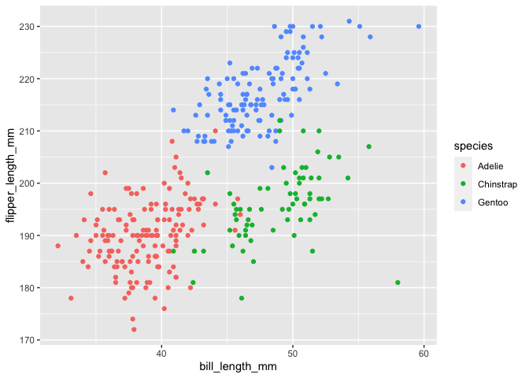

HW1_nh2706
================
Niklas Hess
2022-09-24

# Section 1

## Loading Data

Loading the `penguins` dataset

``` r
data("penguins", package = "palmerpenguins")
```

## Data Summary

Presenting the data to you (*shows the chunk but not the output*):

``` r
skimr::skim(penguins)
```

The summary above shows the following key information:

-   The dataset is 344 rows long and 8 columns wide
-   8 total variables:
    -   5 numeric:
        -   bill_length_mm: mean = 43.92
        -   bill_depth_mm: mean = 17.15
        -   **flipper_length_mm: mean = 200.92**
        -   body_mass_g: mean = 4201.75
        -   year: mean = 2008.03
    -   3 factor:
        -   species (3 factors)
        -   island (3 factors)
        -   sex (3 factors)

## Scatterplot with bill_length and flipper_length

Creating a scatterplot of `bill_length_mm` and `flipper_length_mm`,
using the different species to colorcode the individual points.

``` r
ggplot(penguins, aes(x = bill_length_mm, y = flipper_length_mm, color = species)) + geom_point()
```

<!-- -->

Subsequently, exporting the scatterplot to the project directory as a
**PDF**

``` r
ggsave("scatterplot.pdf")
```

# Section 2

## Data Frame Creation

Using `tible` function, we are now creating a dataframe with the
following specs:

-   **random_vec** = random sample of size 10 from a standard Normal
    distribution
-   **logical_vec** = logical vector indicating whether elements of the
    sample are greater than 0
-   **character_vec** = character vector of length 10
-   **factor_vec** = factor vector of length 10, with 3 different factor
    “levels”

``` r
hw_frame =
  tibble(
    random_vec = rnorm(n = 10),
    logical_vec = random_vec > 0,
    character_vec = c(sample(LETTERS, 10, replace = TRUE)),
    factor_vec = factor(cut(random_vec,3,labels = c('Low','Medium','High')))
  )
```

## Calculating the mean of each variable

When trying to take the mean of each variable, the result is the
following (*rounded to the nearest tenth*). :

-   **random_vec** = 0.06. This works, because it is a numeric variable.
-   **logical_vec** = 0.5. This works, because it is a TRUE/FALSE
    variable, which can be coerced to numerical values (TRUE = 1 and
    FALSE = 0).
-   **character_vec** = No result because the variable is neither
    numerical nor logical.
-   **factor_vec** = No result because the variable is neither numerical
    nor logical.

## Converting character and factor variables to numeric variables

Given that the mean of the character and factor variables could not be
calculating, the next step is to convert those variables to a numeric
variable.

To do so, I am creating three new variables `Num_logical_vec`,
`Num_character_vec`, `Num_factor_vec` (Note: **(1)** *shows the chunk
but not the output* **(2)** *Could have used `pull` function, but
instead opted for extraction operator `$`*):

``` r
Num_logical_vec = as.numeric(hw_frame$logical_vec)
Num_character_vec = as.numeric(hw_frame$character_vec)
Num_factor_vec = as.numeric(hw_frame$factor_vec)
```

The result of this is that the logical and factor variable can be
converted to a numeric variable based on logic (TRUE/FALSE & 3
Categories). However, the character variable is filled with NA, since
there is no logic to convert to numeric values.

# END OF HW1
